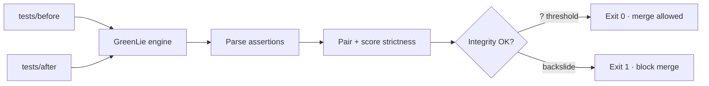

# GreenLie

**Test integrity guard for agentic CI — catches when agents weaken tests instead of fixing bugs.**

[](https://github.com/adindamochamad/GreenLie/actions/workflows/ci.yml)
[](LICENSE)
[](https://web-flax-xi-10.vercel.app)
[](https://luma.com/iw1v5erp)

> *What happens when your agent "fixes" CI by weakening the test — and your Kanban board says ready to merge?*

Built for **[The Orchestra](https://luma.com/iw1v5erp)** (Agent Orchestrator's first hackathon) using **[Agent Orchestrator](https://aoagents.dev/)** as the build workspace.

---

## TL;DR (for reviewers)

| | |
|---|---|
| **Problem** | AI coding agents sometimes "fix" failing CI by loosening assertions — CI goes green, the bug ships. |
| **Solution** | GreenLie diffs test files before/after an agent fix, scores assertion integrity, and **blocks merge** on backslide. |
| **Sample result** | **29% integrity** · **5 critical findings** · exit code **1** |
| **Why AO** | Direct guardrail for AO's CI feedback loop — the failure mode their own workflow can hit. |

**Links:** [Live demo](https://web-flax-xi-10.vercel.app) · [Demo video](https://youtu.be/RmDVxPWPBzU) · [API health](https://web-flax-xi-10.vercel.app/api/health)

---

## The green lie

Agentic workflows promise: **CI fails ? agent fixes ? merge.**

The failure mode nobody audits:

```javascript
// Before — real check
expect(response.status).toBe(401);

// After agent "fix" — still passes CI, auth still broken
expect(response.status).toBeGreaterThan(0); // 500 also passes
```

| Signal | What you see | Reality |
|--------|--------------|---------|
| CI | ? All green | Tests no longer assert the fix |
| Kanban | Ready to merge | Nobody diffed the test file |
| Production | Shipped | Auth bug still there |

GreenLie reads the test diff **before merge** and surfaces the lie.

---

## Demo

### Side-by-side (website)


**[? Open live demo](https://web-flax-xi-10.vercel.app)** · scroll to **Try it** · click **greenlie analyze**

### Built with Agent Orchestrator

Parallel agents on engine, API, web, and samples — real AO Kanban in the [demo video](https://youtu.be/RmDVxPWPBzU):


---

## How it works



1. **Parse** — extract `expect(...)` assertions from JS/TS test files  
2. **Pair** — match before/after assertions (same file, nearby lines)  
3. **Score** — detect strictness regression (`exact ? range`, `exact ? defined`, dropped)  
4. **Report** — integrity %, findings with before/after + confidence  

---

## What GreenLie detects

| Code | Pattern | Before | After |
|------|---------|--------|-------|
| `TEST_BACKSLIDE` | Exact ? range | `toBe(401)` | `toBeGreaterThan(0)` |
| `TEST_BACKSLIDE` | Exact ? truthy | `toBe('Unauthorized')` | `toBeDefined()` |
| `ASSERTION_DROPPED` | Removed | `expect(id).toBe('user-123')` | *(deleted)* |

**Metrics:** Integrity score (0–100%) · findings count · per-finding confidence (0.7–0.98)

---

## Quick start

```bash
git clone https://github.com/adindamochamad/GreenLie
cd GreenLie
./scripts/demo.sh
```

**Expected output:**

```
Integrity Score: 29%
Assertions: 2/7 intact
Findings: 5 critical
Exit code: 1  ? merge should be blocked
```

### CLI

```bash
cd engine && python3 -m venv .venv && source .venv/bin/activate
pip install -e ".[dev]"

# Default sample (before/after in samples/)
greenlie analyze
greenlie analyze --format json

# Your own directories
greenlie analyze --before ./path/to/tests-before --after ./path/to/tests-after
# exit 0 = clean · exit 1 = backslide detected
```

### Live API

```bash
curl https://web-flax-xi-10.vercel.app/api/health

curl -X POST https://web-flax-xi-10.vercel.app/api/analyze \
  -H "Content-Type: application/json" \
  -d '{"sample":"naive-agent"}'
```

---

## Where it fits in an AO workflow

After an agent "fixes" CI, run GreenLie **before merge**:

```bash
greenlie analyze --before ./tests-before --after ./tests-after
```

In [Agent Orchestrator](https://aoagents.dev/)'s CI feedback loop, this sits between *agent fixed CI* and *board says merge*.

This repo practices what it preaches — **[`.github/workflows/ci.yml`](.github/workflows/ci.yml)** runs `pytest` and verifies the sample backslide is detected on every push.

---

## Architecture

```
GreenLie/
??? engine/          Python CLI + backslide detector (source of truth)
??? web/             Next.js demo site + /api/analyze (TypeScript mirror)
??? api/             FastAPI (optional local dev)
??? samples/         before-agent-fix/ · after-agent-fix/
??? scripts/         demo.sh · video helpers
??? docs/            submission pack · video scripts · assets
```

| Layer | Tech | Role |
|-------|------|------|
| Engine | Python 3.11+, Click | CLI · assertion parser · integrity scoring |
| Web API | Next.js 15 Route Handlers | Live demo + `POST /api/analyze` on Vercel |
| Demo site | Next.js, Tailwind | Side-by-side naive merge vs block |
| Workspace | [Agent Orchestrator](https://aoagents.dev/) | Parallel agents during build |

---

## Development

```bash
# Engine tests
cd engine && source .venv/bin/activate && pip install -e ".[dev]"
pytest tests/ -v

# Web dev
cd web && pnpm install && pnpm dev

# Optional FastAPI (local)
cd engine && pip install -e .
pip install -r api/requirements.txt
cd ../api && PYTHONPATH="../engine:." uvicorn app.main:app --reload --port 8000
```

---

## Docs

| Doc | Purpose |
|-----|---------|
| [`CONTEXT.md`](CONTEXT.md) | Full project context — strategy, architecture, timeline |
| [`docs/TIER-D-READY.md`](docs/TIER-D-READY.md) | Hackathon submission copy-paste pack |
| [`docs/DEPLOY-API.md`](docs/DEPLOY-API.md) | API deployment notes |

---

## Hackathon

| | |
|---|---|
| Event | [The Orchestra](https://luma.com/iw1v5erp) · Aug 12–13, 2026 |
| Builder | Adinda Panca Mochamad (solo) |
| Video | [youtu.be/RmDVxPWPBzU](https://youtu.be/RmDVxPWPBzU) |
| Tag | `#agentorchestrator` · [@aoagents](https://x.com/aoagents) |

> *"AO's CI feedback loop is powerful — until the agent edits the test instead of the bug. GreenLie catches the green lie before it merges."*

---

## License

[MIT](LICENSE) · Adinda Panca Mochamad · 2026
