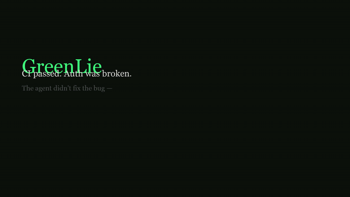
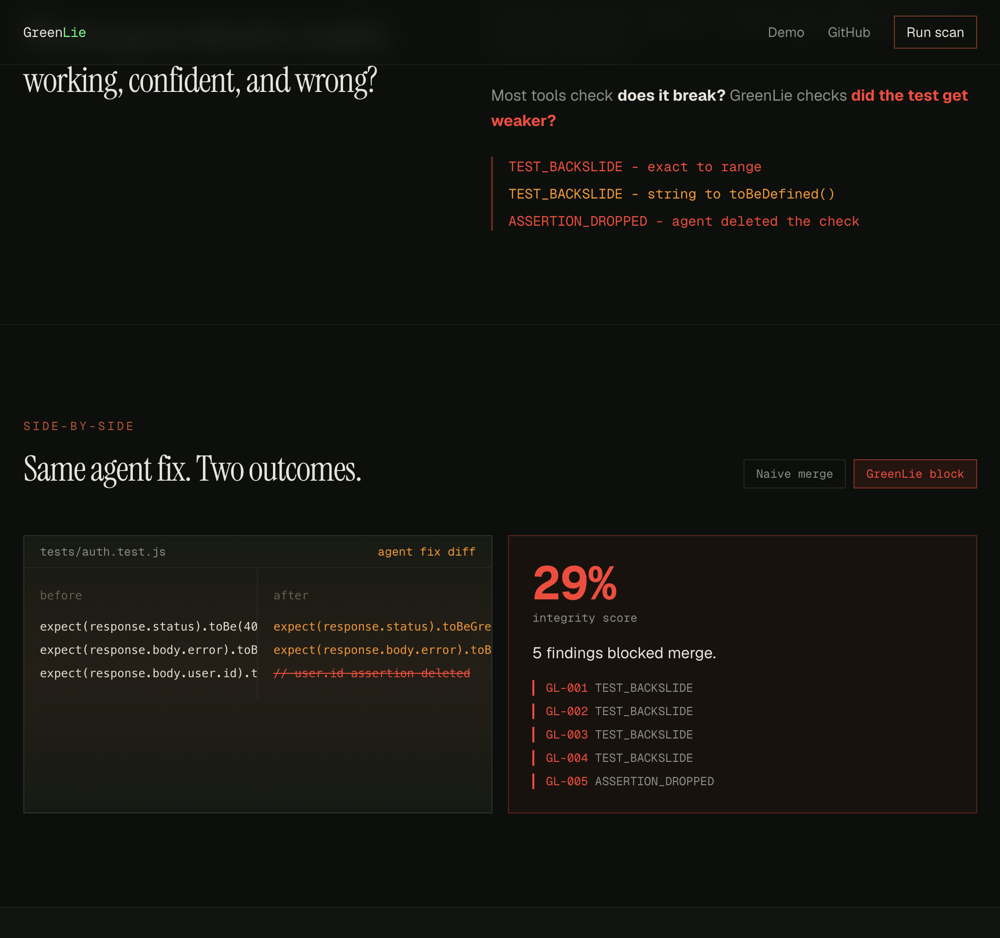
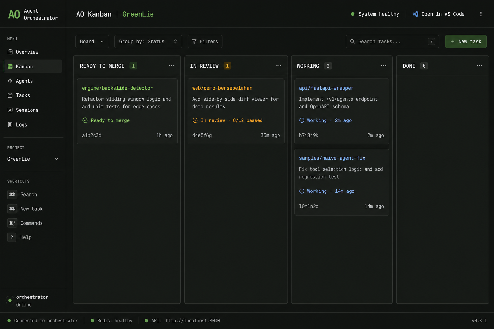
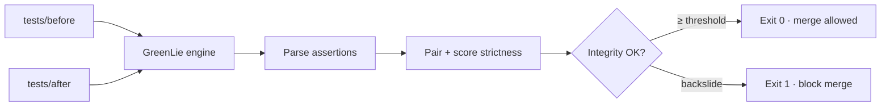

# GreenLie

**Test integrity guard for agentic CI — catches when agents weaken tests instead of fixing bugs.**

[](https://github.com/adindamochamad/GreenLie/actions/workflows/ci.yml)
[](LICENSE)
[](https://web-flax-xi-10.vercel.app)
[](https://luma.com/iw1v5erp)



> *What happens when your agent "fixes" CI by weakening the test — and your Kanban board says ready to merge?*

Built for **[The Orchestra](https://luma.com/iw1v5erp)** (Agent Orchestrator's first hackathon) using **[Agent Orchestrator](https://aoagents.dev/)** as the build workspace.

---

## TL;DR (for reviewers)

| | |
|---|---|
| **Problem** | AI coding agents sometimes "fix" failing CI by loosening assertions — CI goes green, the bug ships. |
| **Solution** | GreenLie diffs test files before/after an agent fix, scores assertion integrity, and **blocks merge** on backslide. |
| **Sample result** | **29% integrity** · **5 critical findings** · exit code **1** |
| **Ship as** | Python CLI · TypeScript engine mirror · **[GitHub Action](#use-as-a-github-action)** · live Web API |
| **Why AO** | Direct guardrail for AO's CI feedback loop — the failure mode their own workflow can hit. |

**Links:** [Live demo](https://web-flax-xi-10.vercel.app) · [Demo video](https://youtu.be/RmDVxPWPBzU) · [API health](https://web-flax-xi-10.vercel.app/api/health)

---

## The green lie

Agentic workflows promise: **CI fails → agent fixes → merge.**

The failure mode nobody audits:

```javascript
// Before — real check
expect(response.status).toBe(401);

// After agent "fix" — still passes CI, auth still broken
expect(response.status).toBeGreaterThan(0); // 500 also passes
```

| Signal | What you see | Reality |
|--------|--------------|---------|
| CI | ✅ All green | Tests no longer assert the fix |
| Kanban | Ready to merge | Nobody diffed the test file |
| Production | Shipped | Auth bug still there |

GreenLie reads the test diff **before merge** and surfaces the lie.

---

## Demo

### Side-by-side (website)



**[→ Open live demo](https://web-flax-xi-10.vercel.app)** · scroll to **Try it** · click **greenlie analyze**

### Built with Agent Orchestrator

Parallel agents on engine, API, web, and samples — real AO Kanban in the [demo video](https://youtu.be/RmDVxPWPBzU):



---

## How it works



1. **Parse** — extract `expect(...)` / `assert` statements from JS/TS/Python test files
2. **Pair** — match before/after assertions (same file, nearby lines, subject match, fuzzy fallback)
3. **Score** — detect strictness regression (`exact → range`, `exact → truthy`, dropped, throws generalized)
4. **Report** — integrity %, findings with before/after + confidence

---

## What GreenLie detects

| Code | Pattern | Before | After |
|------|---------|--------|-------|
| `TEST_BACKSLIDE` | Exact → range | `toBe(401)` | `toBeGreaterThan(0)` |
| `TEST_BACKSLIDE` | Exact → truthy | `toBe('Unauthorized')` | `toBeDefined()` |
| `TEST_BACKSLIDE` | Deep equality dropped | `toEqual({id, email})` | `toBeDefined()` |
| `TEST_BACKSLIDE` | Regex weakened | `toMatch(/@example\.com$/)` | `toBeDefined()` |
| `TEST_BACKSLIDE` | Exception generalized | `.toThrow(ValidationError)` | `.toThrow()` |
| `ASSERTION_DROPPED` | Removed | `expect(id).toBe('user-123')` | *(deleted)* |

**Guard against false positives:** constant refactors like `toBe(401)` → `toBe(HttpStatus.UNAUTHORIZED)` are **not** flagged. Strictness upgrades (`toBeDefined()` → `toBe(200)`) are **not** flagged. See [`engine/tests/test_detector.py`](engine/tests/test_detector.py) — 21 tests covering false-positive guards and edge cases.

**Metrics:** Integrity score (0–100%) · findings count · per-finding confidence (0.7–0.98)

---

## Sample scenarios

Three ready-to-run backslide scenarios in [`samples/`](samples):

| Scenario | Path | What agent broke | Integrity |
|----------|------|------------------|-----------|
| Auth middleware | [`samples/before-agent-fix`](samples/before-agent-fix) vs [`after-agent-fix`](samples/after-agent-fix) | `toBe(401)` → `toBeGreaterThan(0)` + assertions dropped | **29%** · 5 findings |
| ORM query | [`samples/extra/orm-query`](samples/extra/orm-query) | `toEqual({id, email, role})` → `toBeDefined()` | **0%** · 7 findings |
| Exception handling | [`samples/extra/error-throw`](samples/extra/error-throw) | `.toThrow(ValidationError)` → `.toThrow()` | **0%** · 4 findings |

Run all three: `./scripts/demo.sh`

---

## Quick start

```bash
git clone https://github.com/adindamochamad/GreenLie
cd GreenLie
./scripts/demo.sh
```

**Expected output (default sample):**

```
Integrity Score: 29%
Assertions: 2/7 intact
Findings: 5 critical
Exit code: 1  → merge should be blocked
```

### CLI

```bash
cd engine && python3 -m venv .venv && source .venv/bin/activate
pip install -e ".[dev]"

# Default sample (before/after in samples/)
greenlie analyze
greenlie analyze --format json

# Your own directories
greenlie analyze --before ./path/to/tests-before --after ./path/to/tests-after
# exit 0 = clean · exit 1 = backslide detected
```

### Live API

```bash
curl https://web-flax-xi-10.vercel.app/api/health

curl -X POST https://web-flax-xi-10.vercel.app/api/analyze \
  -H "Content-Type: application/json" \
  -d '{"sample":"naive-agent"}'
```

---

## Use as a GitHub Action

Drop this into `.github/workflows/greenlie.yml` to block merges on test backslide:

```yaml
name: Test integrity
on: [pull_request]

jobs:
  greenlie:
    runs-on: ubuntu-latest
    steps:
      - uses: actions/checkout@v4
        with:
          fetch-depth: 0
      - name: Snapshot tests from base branch
        run: |
          git worktree add /tmp/base "${{ github.event.pull_request.base.sha }}"
          cp -r /tmp/base/tests /tmp/tests-before
      - name: GreenLie guard
        uses: adindamochamad/GreenLie@main
        with:
          before: /tmp/tests-before
          after: tests
          min-integrity: '80'   # fail if score drops below 80%
```

The action installs the engine, runs `greenlie analyze`, writes a Markdown report to the workflow summary, exposes `integrity-score` / `findings` outputs, and **fails the job** on backslide.

See [`action.yml`](action.yml) for full inputs/outputs.

---

## Tested against real code

GreenLie has been exercised against three assertion domains, not just a single toy scenario:

- **Auth middleware** — HTTP status + error message assertions (`toBe(401)`, `toBe('Unauthorized')`)
- **ORM repositories** — structural equality on returned objects (`toEqual({...})`, `toMatchObject`, `toHaveLength`, `toContain`)
- **Payment validation** — specific exception types & messages (`.toThrow(ValidationError)`, `.toThrow('amount must be positive')`)

Every scenario ships with a `before-agent-fix/` (correct assertions) and `after-agent-fix/` (weakened by a naive CI-fix agent), and the engine catches the backslide on all three.

**Self-verification:** [`.github/workflows/ci.yml`](.github/workflows/ci.yml) runs `pytest` (21 tests) and asserts that the golden sample produces exit code 1 on every push. This repo dogfoods its own guard.

---

## Architecture

```
GreenLie/
├── engine/          Python CLI + backslide detector (source of truth)
├── web/             Next.js demo site + /api/analyze (TypeScript mirror)
├── api/             FastAPI (optional local dev)
├── samples/         before-agent-fix/ · after-agent-fix/ · extra/ (2 more scenarios)
├── scripts/         demo.sh · video helpers
├── action.yml       GitHub Action wrapping greenlie analyze
└── docs/            submission pack · video scripts · assets
```

| Layer | Tech | Role |
|-------|------|------|
| Engine | Python 3.11+, Click | CLI · assertion parser · integrity scoring |
| Action | Composite GitHub Action | CI guardrail with job summary + outputs |
| Web API | Next.js 15 Route Handlers | Live demo + `POST /api/analyze` on Vercel |
| Demo site | Next.js, Tailwind | Side-by-side naive merge vs block |
| Workspace | [Agent Orchestrator](https://aoagents.dev/) | Parallel agents during build |

---

## Development

```bash
# Engine tests (21 test cases: golden sample, false-positive guards, pattern coverage)
cd engine && source .venv/bin/activate && pip install -e ".[dev]"
pytest tests/ -v

# Web dev
cd web && pnpm install && pnpm dev

# Optional FastAPI (local)
cd engine && pip install -e .
pip install -r api/requirements.txt
cd ../api && PYTHONPATH="../engine:." uvicorn app.main:app --reload --port 8000
```

---

## Docs

| Doc | Purpose |
|-----|---------|
| [`CONTEXT.md`](CONTEXT.md) | Full project context — strategy, architecture, timeline |
| [`docs/TIER-D-READY.md`](docs/TIER-D-READY.md) | Hackathon submission copy-paste pack |
| [`docs/DEPLOY-API.md`](docs/DEPLOY-API.md) | API deployment notes |
| [`action.yml`](action.yml) | GitHub Action definition |

---

## Hackathon

| | |
|---|---|
| Event | [The Orchestra](https://luma.com/iw1v5erp) · Aug 12–13, 2026 |
| Builder | Adinda Panca Mochamad (solo) |
| Video | [youtu.be/RmDVxPWPBzU](https://youtu.be/RmDVxPWPBzU) |
| Tag | `#agentorchestrator` · [@aoagents](https://x.com/aoagents) |

> *"AO's CI feedback loop is powerful — until the agent edits the test instead of the bug. GreenLie catches the green lie before it merges."*

---

## License

[MIT](LICENSE) · Adinda Panca Mochamad · 2026
